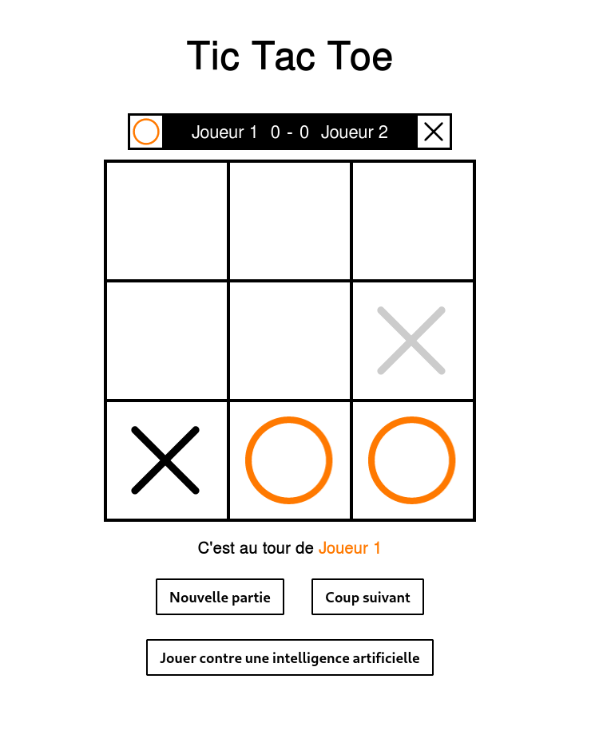

# OBS_seminar

OBS How to set up a geolocation and tracking solution for an industrial customer?

Seminar using Orange OBS Tracking service demo API.

We have developped a Tic Tac Toe game using the tracking API. Each player uses the same geolocated tracker tag to play the game. He can see in real time the position of the tracker as a preview (in grey). Then pushing `coup suivant` will keep the current position as the player move.

Is is also possible to play against an AI.

